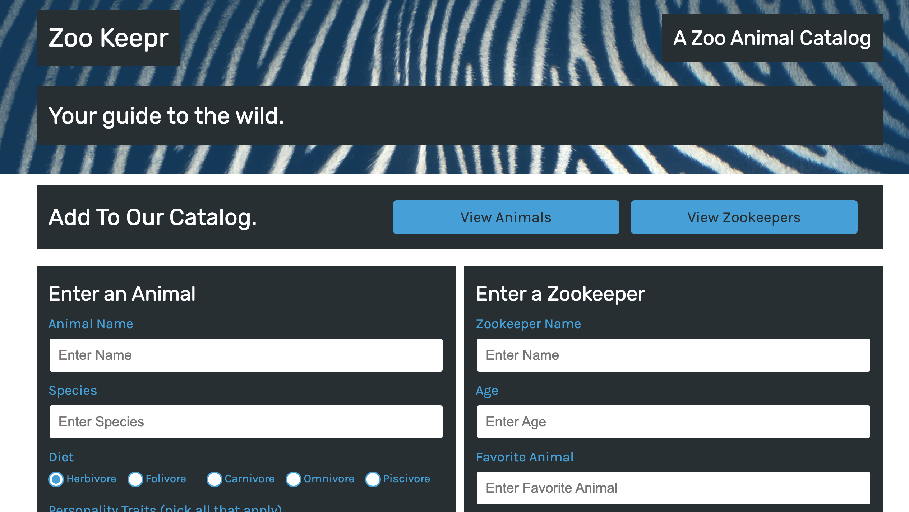

# Zookeepr

## Description
Application for displaying, adding, and searching for animals and zookeepers. Web server built with Express.js framework.

## License  
This application is covered under the following license. Please review the link below for additional information pertaining to the license.
    
  
https://www.gnu.org/licenses/gpl-3.0

## Table of Contents
[Deployed Application](#deployed-application)  
[Built With](#built-with)  
[Landing Page](#landing-page)  
[Installation](#installation)  
[Testing](#testing)  
[Contribution](#contribution)  

## Deployed Application
https://zookeepr-dch.cyclic.app/

## Built With
* JavaScript
* Node.js
* Express.js
* Jest
* HTML
* CSS
* Git
* Cyclic

## Landing Page

## Installation
To run locally once cloned:
* Enter `npm install` in the command line while in the root folder to install the required npm packages
* Enter `npm start` in the command line while in the root folder to launch the application

## Testing
* Enter `npm test` in the command line while in the root folder to run Jest

## Contribution
Built by Dylan Hay